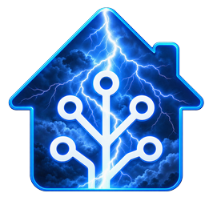

# Home Assistant xLightning

[](https://github.com/Pedals2Paddles/Home-Assistant-xLightning/actions/workflows/validate.yml)
[](https://hacs.xyz)



The Home Assistant xLightning integration provides near real-time lightning detection! The integraton polls the [Vaisala Xweather lightning API](https://www.xweather.com/products/weather-api/lightning) with a set of location coordinates and exposes the results as a Home Assistant device with sensor and binary sensor entities. Each config entry is one monitored location: one device, one polling coordinator, one set of entities. Add the integration multiple times for multiple locations.

Vaisala Xweather offers free API access to their vast set of live and historical data, including their [lightning API](https://www.xweather.com/products/weather-api/lightning). The free tier allows up to 15,000 API requests per month. We have to be smart about how often data is polled in order to not exceed that free tier limit, unless of course you wish to pay for more. I do not pay for more, nor am I going to, so this is written purely from the perspective of free tier utilization.

---

## Prerequisite: Free Xweather API Credentials

Xweather authentication is OAuth-style userless access with a **client ID** and **secret key** pair, both sent as query parameters by the integration on every request. You will need to sign up for Xweather API access. 

1. Sign up at [xweather.com](https://www.xweather.com/pricing/weather-api-pay-as-you-go).
2. Register an application. You will be asked for a **namespace** — the domain or bundle identifier requests will come from. Calling it something super creative like `Home Assistant` is fine.
3. Copy the generated client ID and secret key. You will need it to configure the device in Home Assistant.

---

## Installation

**Manual**

Copy `custom_components/xweather_lightning/` into your Home Assistant `config/custom_components/` directory and restart.

**HACS**

HACS → three-dot menu → Custom repositories → add
`https://github.com/Pedals2Paddles/Home-Assistant-xLightning` with category **Integration**. Install it and restart Home Assistant.

Then: **Settings → Devices & Services → Add Integration → Xweather Lightning**.

Setup asks for a location name, the client ID and secret key. You will get a map marker for the coordinates (pre-filled with your Home Assistant location). The coordinates are the origin for every distance the integration reports.

---

## Device Configuration Options

Radius, alert distance, lookback window, and polling interval are changed via **Configure** on the integration device. Changing any of them reloads the device and its entities.

**Search radius** and **Nearby alert distance** display in whichever distance unit Home Assistant is configured for (km, mi, or otherwise) — pick the number that makes sense to you, no conversion needed. The API uses KM, so any other unit of measure is converted in the user interface.  

| Option | Default | Notes |
|---|---|---|
| Search radius | 50 km | The radius around the configured location inside which lightning strike data is monitored. The free tier caps this at 100 km. |
| Nearby alert distance | 16 km | Distance from the configured location inside which a strike will trip the `Lightning Nearby` binary_sensor. Requires the `Enable detailed strike polling` to be enabled in order to obtain distance data. |
| Lookback window | 5 min | Time range worth of aggregated strike data the API returns. Now minus minutes. The free tier maximum is 5 minutes. |
| Polling interval | 300 s | How often the integration polls the Xweather API for new data. |
| Keep last strike for | 60 min | How long the "Nearest ..." sensors keep showing the last strike after the storms move out of the search radius. If 0, API polls with no strikes will immediately blank out (unknown) the "Nearest..." sensors.  This timer allows the last received value to coast for X minutes. |
| Enable detailed strike polling | on | ON enables polling of the `/lightning/` API endpoint that returns detailed aggregated data on the nearest lightning strike. This populates all the "Nearest..." sensor entities. When this setting is disabled, all the entities which rely on it are set for not visible to reduce clutter. |
| Map frames | 0 | **0** no map entity at all, **1** a single still image, **N** an animated GIF of N frames. |
| Map style | Icons | Bolt icons, strike circles, or icons over a radar underlay. |
| Map size | 640 | Square edge in pixels. |

### Lookback Window vs Polling Interval Relationship

The aggregate counts from the `/lightning/summary/` API endpoint are a **rolling lookback ending at the moment of the API poll.** Each poll asks "how many pulses in the trailing N minutes?", where N is the `lookback window` minutes. The free tier of xWeather allows a maximum of 5 minutes lookback. If you keep the `Polling Interval` set to match the `lookback window`, your data set will be continuous without gaps. This is the most ideal configuration. Therefore both default to 5 minutes.

| | Result |
|---|---|
| Lookback window **=** polling interval | Samples tile cleanly. Summing them gives a true total. Default of 5 minutes for both. |
| Lookback window **<** polling interval | Gaps between samples. Strikes in the gap are never counted. Reduces API calls at the expense of gaps in data, which may or may not be ok for you. |
| Lookback window **>** polling interval | Samples overlap; the same strike is counted in several of them. Summing over-counts. Bad idea, don't do this. |


## Entities

Each location based device provides the following entities:

### Binary sensors

| Entity | On when |
|---|---|
| Lightning detected | At least one pulse detected inside the search radius |
| Lightning nearby | Closest strike is within the nearby alert distance (requires `Enable detailed strike polling` toggle on to obtain the nearest strike distance.) |

### Sensors — aggregate counts (`/lightning/summary` API endpoint)

| Entity | Unit |
|---|---|
| Pulse count | pulses |
| Cloud-to-ground pulses | pulses |
| Intracloud pulses | pulses |
| Positive polarity pulses | pulses |
| Negative polarity pulses | pulses |
| Peak amplitude maximum | A |
| Peak amplitude average | A |
| Last pulse | timestamp |

Counts report `0` rather than `unknown` when there are no detected strikes, so history graphs and long-term statistics stay continuous.

### Sensors — nearest individual strike (`/lightning/` API endpoint)

These entities require the `Enable detailed strike polling` configuration toggle to be on.  When the basic summary polling detects >0 strikes in the search radius (`pulse count > 0`), the integration will begin polling for and populating this data as well.  When there are no strikes within the search radius (`pulse count = 0`), polling for this detailed strike data ceases. There is no need to poll for non-existent data. Polling this API endpoint is a 10x hit against your API request count. Therefore it is critical to avoid pointless polling to avoid hitting your 15,000 requests per month free tier API request limit.

| Entity | Unit |
|---|---|
| Nearest strike distance | km (auto-converts to miles on imperial systems) |
| Nearest strike bearing | ° |
| Nearest strike direction | cardinal, e.g. SSW |
| Nearest strike type | Cloud-to-ground / Intracloud |
| Nearest strike peak amplitude | A |
| Nearest strike time | timestamp |
| Nearest strike age | s |

**Nearest strike distance** carries the strike's own latitude and longitude as attributes, plus the number of detecting sensors and the chi-square confidence metric (lower means the sensor observations agreed more closely). The coordinates let you plot the strike on a map card.

### Image

**Lightning map** — present only when the map configuration option is on (>0). Attributes carry the bounding box, the kilometres covered, the padding percentage, the resolved layer stack, and the frame count.

### Diagnostic

Search radius reflects the configured option, useful for templating.


### Retention

Once there are no strikes detected within the configured Search Radius, the API has nothing to return. This will blank every "Nearest ..." sensor to `unknown`. This kind of looks broken, but it is impossible to store a non-existent measurement. Zero would not be appropropriate since zero also could mean lightning is repeatedly striking your house.

**Retention** keeps the last strike on the "Nearest ..." sensors for the configured period rather than blanking them immediately. During the retention window:

- `Nearest strike age` keeps climbing, recomputed each poll, so it is obvious the reading is historical.
- `Nearest strike time` renders as relative time in the UI ("47 minutes ago").
- `Nearest strike distance` carries a `retained: true` attribute.
- **`Lightning nearby` stays off.** Retention never latches the proximity alert, because that sensor is safety-critical and must be based on truely live data.

Retained strikes live in memory, so a Home Assistant restart during the retention period drops the "Nearest ..." sensors back to `unknown` immediately, as if retention had already expired. The recorded history is unaffected.

### API request multipliers

This matters more than it usually does, because one of the two endpoints is metered at a premium:

- `/lightning/summary` — no multiplier listed, so 1x.
- `/lightning/` — **10x multiplier**, and on standard access limited to a 100 km radius, the past 5 minutes, and 1000 strikes per query.


**Enable detailed strike polling** (on by default) controls whether the individual-strike `Nearest ...` sensors exist at all. There is no mode where `/lightning` is queried unconditionally: both queries use the same radius and window, so when the 1x summary reports zero pulses, the 10x `/lightning` query provably has nothing to return, and it is skipped even while the option is on. Turning the option off just removes the sensors and the possibility of that query firing — it costs nothing extra to leave on if you want the detail whenever there's something to find, and the map image refresh cadence is unaffected either way (see [The lightning map](#the-lightning-map) below).

At the 5 minute default, 288 polls a day or approx 8600 polls per month out of a 15,000 poll free tier maximum.

| Configuration | Units/day |
|---|---|
| Detailed polling off | **288** |
| Detailed polling on, quiet day | 288 |
| Detailed polling on, storms ~5% of the day | 438 |

The Xweather Lightning Enterprise add-on drops the multiplier to 1x and lifts the radius to 500 km, the lookback to 24 hours, and the result cap to 50,000.

**Watching the spend.** The **API requests** diagnostic sensor counts actual HTTP requests, with a per-endpoint breakdown (`summary_requests`, `lightning_requests`, `map_requests`) and a `lightning_skipped_last_poll` flag in its attributes. It reports raw request counts rather than a units figure, because only you know whether your plan carries the 10x multiplier. Multiply by your own rate. The counter resets on restart or reload.

---

## The lightning map

Controlled by a single **Map frames** setting:

| Frames | Result | Cost per render |
|---|---|---|
| 0 (default) | No image entity is created at all | — |
| 1 | A single still PNG | ~10 units |
| N (2–24) | An animated GIF of N stills at 5 minute steps | ~10 × N units |

At 1 or more you get an image entity rendering an [Xweather Raster Maps](https://www.xweather.com/docs/maps/getting-started/static-maps) static image. Changing frames reloads the entry; going to 0 removes the entity.

**Framing.** The map uses the bounding-box request form, so the API derives centre and zoom itself from a box covering your search radius **plus 10% padding** — strikes sitting exactly on the edge of the radius are not clipped. The box is computed as a true square in kilometres, correcting for longitude convergence, so it stays square at any latitude. The `bounding_box` and `covers_km` attributes show the exact framing.

**Layer choice follows your data window.** A lookback of 5 minutes or less uses the `lightning-strikes-5m` layer; anything longer uses the 15 minute layer. The picture and the sensor counts then describe the same span of time.

**Refresh policy.** Two independent gates keep this cheap:

1. The entity only marks itself stale when there is something new worth seeing — the first update, any poll with active lightning, and the transition out of active so the last frame is accurate. Steady quiet never invalidates.
2. Imagery is fetched **lazily, on view**. Marking stale costs nothing; bytes are only requested when something actually asks for the image. If no dashboard is open, the map makes zero requests.

On a simulated day with one six-poll storm, that is 9 invalidations out of 288 polls — and 0 map requests if nobody is looking at the dashboard.

**Cost.** Lightning map layers carry the same **10x multiplier** as the data endpoint, so each rendered still is ~10 units. The radar style adds a radar underlay at additional cost.

### Animation

Raster Maps animation is a client-side feature of their JavaScript SDK — there is no server-rendered animated GIF URL to point an image entity at. So at 2 or more frames, this integration fetches that many stills at 5 minute offsets (matching the layer's own refresh cadence) and assembles them into a GIF locally.

That multiplies the cost of every render by the frame count: 6 frames is 6 requests, roughly 60 units, each time the image is actually rendered. The ceiling is 24 frames, a 115 minute span, well inside the layer's `-7 days` range. This is really only sensible on a plan where the 10x multiplier has been lifted.

GIF assembly uses Pillow, imported lazily rather than declared as a requirement, to avoid pinning a version that could conflict with Home Assistant core's own. Pillow is present on essentially every install; if it is missing, the map falls back to a single still and logs a warning.

---

## Example automation

```yaml
automation:
  - alias: Lightning within 10 miles
    triggers:
      - trigger: state
        entity_id: binary_sensor.home_lightning_lightning_nearby
        to: "on"
    actions:
      - action: notify.mobile_app
        data:
          title: Lightning nearby
          message: >-
            Strike {{ states('sensor.home_lightning_nearest_strike_distance') }}
            {{ state_attr('sensor.home_lightning_nearest_strike_distance',
               'unit_of_measurement') }} to the
            {{ states('sensor.home_lightning_nearest_strike_direction') }}.
```

---

## Editing the location

Coordinates, name, and credentials are changed via the **⋮ menu → Reconfigure** on the device or integration entry — not through Configure. They live in the config entry data rather than the options because the coordinates form the entry's unique ID.

Entity unique IDs are derived from the config entry ID, not from the coordinates, so moving the marker keeps every existing entity and all of its recorded history. Only the point that distances are measured from changes. The entry reloads automatically.

If you move a location onto coordinates another entry already monitors, setup aborts with "already configured" rather than creating a duplicate. Coordinates are rounded to 5 decimal places (~1 m) before comparison, so trivial marker nudges won't be treated as a move.

Renaming here also renames the device, unless you have renamed the device manually in the device registry — a manual rename always wins.

---

## How credentials appear in URLs

The two Xweather products format the same credential pair differently. This catches people out.

**Weather API** (`data.api.xweather.com`) — two separate **query parameters**:

```
https://data.api.xweather.com/lightning/summary/closest?p=44.98,-93.27&radius=50km&client_id=abc123&client_secret=def456
```

**Raster Maps** (`maps.api.xweather.com`) — joined into a **single path segment** with an underscore between them, as the first segment after the host:

```
https://maps.api.xweather.com/abc123_def456/flat-dk,lightning-strikes-5m-icons,admin-dk/640x640/44.4859,-93.9685,45.4741,-92.5715/current.png
                              └──────┬─────┘
                          client_id _ client_secret
```

No `?`, no parameter names, no separate fields — one segment, one underscore. Xweather credentials are alphanumeric, so the underscore is unambiguous as a separator.

---

## Design notes

- A single `DataUpdateCoordinator` poll feeds every entity, so the entity count has no bearing on API usage. Each poll does write state for all entities: the payload carries request counters and a strike age that change every cycle, so it never compares equal to the previous one.
- Runtime state lives on `ConfigEntry.runtime_data`, typed via `XWeatherLightningConfigEntry`.
- Auth failures raise `ConfigEntryAuthFailed`, which opens the reauth flow rather than retrying against credentials that will keep failing. Quota and connection failures raise `UpdateFailed` and back off normally.
- `api.py` is Home Assistant agnostic and can be exercised standalone.
- Diagnostics redact credentials and coordinates.

## Known rough edges

- **The summary is now load-bearing.** With detailed polling enabled, `/lightning` is only queried once the summary reports a nonzero pulse count — a summary that always reports zero, even through a storm, silently keeps the strike query from ever firing and the "Nearest ..." sensors stay unknown forever. There is no toggle that forces `/lightning` to run unconditionally to rule this in or out; if the "Nearest ..." sensors stay unknown through a storm you can see out the window, enable debug logging (below) and check what `/lightning/summary` is actually returning.
- **Verify the summary request shape.** The `/lightning/summary` docs describe the response fields precisely but present the request parameters in a JavaScript tab that does not render in plain HTML, so the exact `closest` + `p` + `radius` combination used here was inferred from the general query conventions rather than read verbatim. The client normalises both object and single-item-array responses, and `api.py` logs the raw payload at debug level. If counts come back empty while the curl above returns data, that request is the first place to look. Enable debug logging with:

  ```yaml
  logger:
    logs:
      custom_components.xweather_lightning: debug
  ```

- Peak amplitude is reported in amperes with the `current` device class. Raw values run in the thousands (a −7000 A strike is −7 kA); a template sensor dividing by 1000 gives you kiloamps if you prefer.